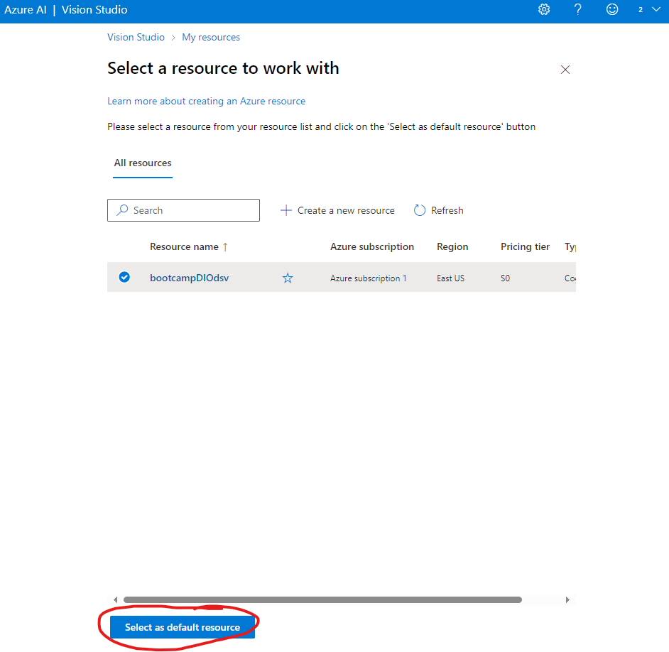

Passo-a-passo para criação e utilização do Azure Vision Studio.

Primeiro Passo - criação do recurso:
O primeiro passo consiste com a criação do recurso Azure AI Services através do https://portal.azure.com.

Utilizando o Recurso:

Após o recurso criado, devemos acessar o site https://portal.vision.cognitive.azure.com/ e selecionar o recurso criado como default (figura 1.0):

Após selecionar o resorce como default podemos fechar a página através do X presente no canto superior direito da figura 1.0.

Na guia "Optical character recognition" iremos selecionar o recurso de "Extract text from images" (figura 1.1).

Nesta sessão iremos adicionar imagens que queremos reconhecer o texto clicando em "Drag and drop a file here or Browse for a file or Take a photo". A imagem selecionads para esse treinamento está presente na pasta input-imagem-treinamento.

O output da imagem pode ser selecionado como um texto ou como um JSON. Para o meu caso, utilizarei o JSON que estará armazenado na pasta json-output-treinamento.

Abaixo podemos verificar a imagem dada como input e o resultado do reconhecimento de texto em "Detected attributes" (figura 1.2):

Insights:
Esse recurso pode ser utilizado com bom proveito para retirar dados de documentos assinados de forma manuscrita por clientes e organisá-los em documentos digitais ou até mesmo em banco de dados.
